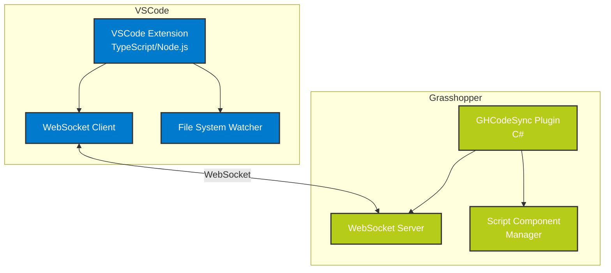

# GHCodeSync

<div align="center">
   
</div>

Grasshopperのスクリプトコンポーネント開発をVSCodeで行うための連携ツールです。WebSocketベースの双方向通信により、VSCodeの強力な開発支援機能をGrasshopperのスクリプト開発で活用できます。

## 概要

本ツールは、Grasshopperの組み込みエディタの制限（基本的な自動補完のみ、AI支援機能なし、高度なコード分析ツールの不在など）を解決し、現代的な開発環境でのスクリプト開発を可能にします。VSCodeの強力な機能群を活用することで、より効率的で品質の高いパラメトリックデザインの開発を実現します。

## プロジェクト構成

プロジェクトは以下のコンポーネントで構成されています：



## インストール

### VSCode拡張
```bash
code --install-extension ghcodesync-*.vsix
```

### Grasshopperプラグイン
1. `GHCodeSync.gha`をGrasshopper Componentsフォルダにコピー
   - Windows: `%AppData%\Grasshopper\Libraries`
   - macOS: `/Users/[ユーザー名]/Library/Application Support/Grasshopper/Libraries`
2. Rhinocerosを再起動

## 使用方法

1. VSCodeでGrasshopper拡張を有効化
   ```
   Cmd/Ctrl + Shift + P > GHCodeSync: Connect to Grasshopper
   ```

2. 接続状態の確認
   - VSCodeのステータスバーに接続状態が表示されます
   - 緑色のチェックマーク: 接続済み
   - 赤色のX: 未接続

3. スクリプトの編集
   - 対象のC#スクリプトコンポーネントを選択
   - VSCodeで編集
   - 保存時に自動的にGrasshopperへ反映

4. エラー表示
   - コンパイルエラー: 問題パネルに表示
   - 実行時エラー: 出力パネルに表示

## 開発者向け情報

### ビルド方法

#### VSCode拡張
```bash
cd vscode-plugin
npm install
npm run compile
```

#### Grasshopperプラグイン
```bash
cd gh-plugin
dotnet build
```

### デバッグ方法

1. VSCode拡張のデバッグ
   - F5キーでデバッグ用のVSCodeインスタンスを起動
   - 拡張機能のデバッグコンソールで通信ログを確認

2. Grasshopperプラグインのデバッグ
   - Visual StudioでGHCodeSync.slnを開く
   - デバッグ設定：Rhinoのパスを指定
   - デバッグ実行（F5）

## 注意事項

- Grasshopperのバージョン要件: 7.0以上
- .NET Framework 4.8以上が必要
- ファイアウォールでWebSocket通信（デフォルトポート:8080）が許可されていることを確認

## ライセンス

MIT License