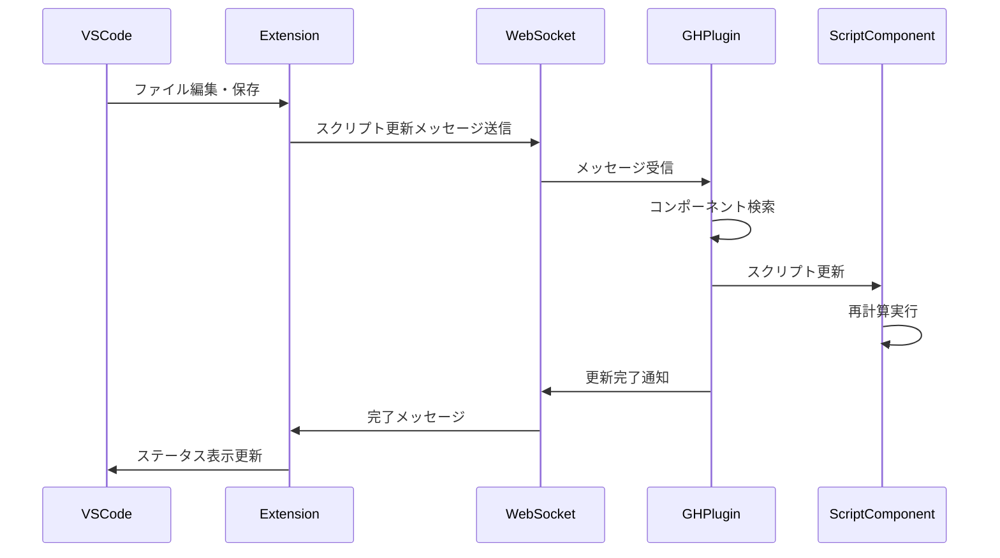
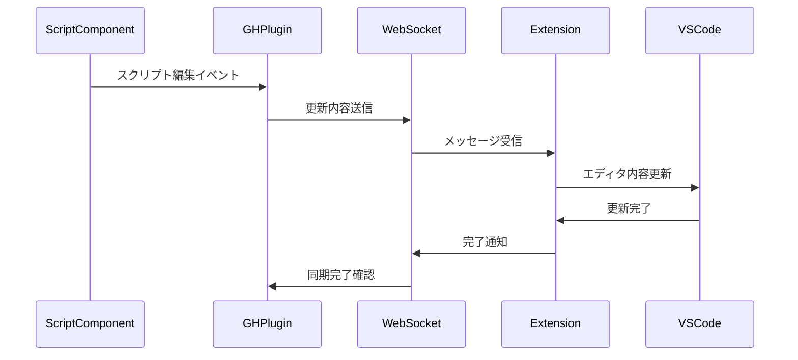

# Grasshopper ScriptComponent × VSCode 拡張 連携方針

---

## 概要
- Grasshopper ScriptComponent のスクリプト内容と VSCode の エディタ内容をリアルタイムまたは任意タイミングで同期させる
- 双方向（VSCode→Grasshopper, Grasshopper→VSCode）の更新が可能なインテグレーションを目指す

---

## アーキテクチャ構成

### 1. VSCode拡張（TypeScript、Node.js）
- サイドバー、コマンドパレット、TextDocument保存イベントをフック
- 編集されたテキスト/イベントをRhino側へ送信
- WebSocketクライアントとしてGrasshopperプラグインと通信

### 2. Grasshopper用C#プラグイン (GH_AssemblyPriority等)
- WebSocketサーバーを常駐させ、VSCode拡張からの接続を待機
- ScriptComponent（または複数）を探索し、指定内容を書き換え
    - 受信: VSCode側から送信されたスクリプトを適用
    - 送信: Grasshopper内で編集された内容もVSCodeへ通知（任意タイミング）

---

## 技術的詳細

### 通信プロトコル
- WebSocket (JSON-RPCベース)
    - サーバー: Grasshopper プラグイン側（デフォルトポート: 8080）
    - クライアント: VSCode 拡張側
- メッセージ構造：
```json
{
    "type": "setScript",
    "target": "COMPONENT_GUID",
    "code": "スクリプト内容",
    "language": "csharp"
}
```

### シーケンス図

#### VSCode → Grasshopper の同期


#### Grasshopper → VSCode の同期


### メイン処理フロー

#### VSCode→Grasshopper
1. VSCodeで編集・保存
2. 拡張がWebSocketを通じてGrasshopperプラグインへテキスト送信
3. GrasshopperプラグインがScriptComponentの.Textや.SetSource()を更新・再計算

#### 実装詳細

1. WebSocket サーバーの設定
```csharp
// Grasshopper プラグイン側
public class WebSocketServer {
    private WebSocketServer _server;
    
    public void Start() {
        _server = new WebSocketServer("ws://localhost:8080");
        _server.Start(socket => {
            socket.OnMessage = (message) => HandleMessage(message);
        });
    }
    
    private void HandleMessage(string message) {
        var request = JsonConvert.DeserializeObject<ScriptUpdateRequest>(message);
        UpdateScriptComponent(request);
    }
}
```

2. スクリプト更新処理
```csharp
private void UpdateScriptComponent(ScriptUpdateRequest request) {
    // アクティブなGHドキュメントの取得
    var ghDoc = Instances.ActiveCanvas?.Document;
    if (ghDoc == null) return;

    // 対象コンポーネントの検索
    var component = ghDoc.Objects.FirstOrDefault(obj => 
        (obj.GetType().FullName.Contains("ScriptComponent") ||
         obj.GetType().FullName.Contains("CSharpComponent")) &&
        obj.InstanceGuid.ToString() == request.target
    );

    if (component != null) {
        // スクリプトの更新
        UpdateComponentSource(component, request.code);
    }
}
```

3. コンポーネントの更新と再計算
```csharp
private void UpdateComponentSource(IGH_DocumentObject component, string code) {
    // SetSourceメソッドまたはTextプロパティを使用
    var setSourceMethod = component.GetType().GetMethod("SetSource");
    if (setSourceMethod != null) {
        setSourceMethod.Invoke(component, new object[] { code });
    }
    else {
        var textProperty = component.GetType().GetProperty("Text");
        if (textProperty?.CanWrite == true) {
            textProperty.SetValue(component, code, null);
        }
    }

    // 更新の適用
    component.Attributes.ExpireLayout();
    component.ExpireSolution(true);
}
```

#### Grasshopper→VSCode
1. ScriptComponent上で編集
2. プラグインが編集イベントを検知
3. WebSocketを通じてVSCode拡張側へ同期送信
```json
{
    "type": "scriptUpdated",
    "source": "grasshopper",
    "target": "COMPONENT_GUID",
    "code": "更新されたスクリプト内容"
}
```

### 補助機能案
- 対象ScriptComponentの特定：
    - GUID、NickName、User設定のタグなどで一意指定
- エラー・出力結果の転送：
    - Grasshopper側の計算結果・ログ・エラー等もWebSocketで転送
- 複数スクリプト・複数Componentにも対応可能

---

## メリット

- VSCodeの高度な編集体験（補完・Lint・構文色分け等）とGrasshopperの即時評価の融合
- 多人数・複数ファイル・複数Componentも拡張可能
- 柔軟なUI/UX（VSCode Extensionとして実装できる）
- バージョンアップ・拡張（トランスパイル、デバッグ等）も容易

---

## イメージ図
