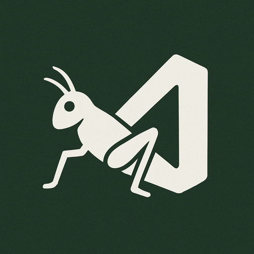

    <h1>GHCodeSync</h1>
    

        
    

     
    

## 概要
GHCodeSyncは、GrasshopperのC#スクリプトコンポーネントをVSCodeで編集できるようにする拡張機能です。WebSocketベースの双方向通信を使用することで、VSCodeの強力な開発機能をGrasshopperスクリプト開発に活用できます。

## 前提条件

- Visual Studio Code: 1.70.0以降
- Rhinoceros: 8.18.25100.11001以降
- GHCodeSync Grasshopperプラグイン（McNeel PackageManagerからインストール可能）

## インストール

1. VSCodeマーケットプレイスから「GHCodeSync」をインストールします。
2. Grasshopperプラグイン側もインストールする必要があります：
   - Rhinocerosを起動し、McNeel PackageManagerを開きます
   - 「GHCodeSync」を検索してインストールします

## 使用方法

1. Rhinocerosを起動し、Grasshopperを開きます
2. C#スクリプトコンポーネントを選択します
3. ツールバーの「Open with VSCode」ボタンをクリックします
4. VSCodeでスクリプトを編集します
5. 保存（Ctrl+S）すると、変更が自動的にGrasshopperに同期されます

## 機能

- リアルタイムコード同期
- インテリジェントなコード補完
- シンタックスハイライト
- エラー検出
- リファクタリングツール

## ライセンス

このプロジェクトはMITライセンスの下で公開されています。詳細は[LICENSE](LICENSE)ファイルをご覧ください。